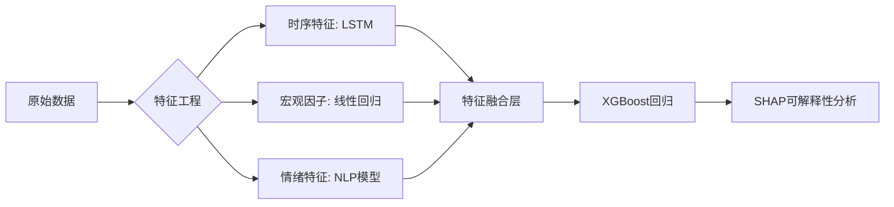

以下是针对**国内实际生活场景**的机器学习项目方案，重点说明**数据来源、问题难点、预测目标、关键技术**，确保项目**可落地、有挑战、适合求职展示**：

---

### **项目1：抖音热门视频点赞量预测（回归）**
#### **数据来源**  
- **公开爬取**：抖音热搜榜页面（非个人账号数据），获取：  
  - 视频标题、作者粉丝数、BGM、标签、发布时间、前1小时播放量/评论数  
  - **数据量**：每天爬取Top 500视频，持续1个月 → 约1.5万条样本  
- **辅助数据**：抖音官方热歌榜（API）、节日日历（如春节/国庆）  

#### **问题难点**  
1. **数据稀疏性**：爆款视频极少（长尾分布），需处理样本不均衡  
2. **时效性强**：热门内容生命周期短（1-3天），需时间序列特征  
3. **NLP特征提取**：标题关键词（如“挑战”“教程”）影响传播  

#### **预测目标**  
- **回归任务**：输入视频发布后1小时的数据，预测24小时后点赞量（RMSE评估）  
- **可扩展分类任务**：预测是否进入当日Top 100（二分类）  

#### **关键技术**  
1. **特征工程**：  
   - 时间特征：`发布时间段（晚8点黄金档）`、`是否节假日`  
   - 文本特征：`标题情感分析（BERT微调）`、`BGM热度排名`  
2. **模型选择**：  
   - 树模型（XGBoost）处理结构化特征 + LSTM处理时序播放量序列  
3. **可解释性**：SHAP分析关键因素（如“粉丝数比发布时间影响更大”）  

---

### **项目2：外卖店铺评分预测（分类）**
#### **数据来源**  
- **美团/饿了么公开店铺页爬取**（合法范围）：  
  - 基础信息：评分、月销量、人均价、配送费、是否品牌连锁  
  - 差评关键词（仅统计频次，不存储原文）  
- **外部数据**：高德地图API获取`周边3公里竞对数量`、`地铁站距离`  

#### **问题难点**  
1. **数据噪声大**：用户评分主观性强（同一店铺可能有5星和1星）  
2. **特征耦合**：价格和销量高度相关，需解决多重共线性  
3. **冷启动问题**：新店铺缺乏历史数据  

#### **预测目标**  
- **分类任务**：预测店铺评分是否≥4.5星（二分类，F1评估）  
- **回归扩展**：预测具体评分（1-5星，MAE评估）  

#### **关键技术**  
1. **特征工程**：  
   - 构造`性价比特征` = 人均价 / 评分  
   - NLP提取差评高频词（TF-IDF + 关键词过滤）  
2. **模型优化**：  
   - 逻辑回归（可解释性） + LightGBM（处理非线性关系）  
3. **处理样本不均衡**：SMOTE过采样低评分店铺  

---

### **1. 小红书爆款笔记互动量预测（回归）**
#### **数据来源**  
- **公开爬取**：小红书探索页笔记（标题、点赞、收藏、标签、发布时间）  
- **辅助数据**：小红书官方周榜（美妆/穿搭类Top100）  
- **数据量**：爬取1000篇笔记（非用户数据，仅内容维度）  

#### **问题难点**  
- 互动量长尾分布（少数笔记爆火）  
- 标题关键词与流量强相关（如"平价"、"测评"）  

#### **预测目标**  
输入笔记发布后2小时的数据（点赞、收藏），预测24小时后的总互动量（RMSE评估）  

#### **关键技术**  
- **NLP特征**：标题情感分析（BERT微调） + 标签热度（平台 trending tags）  
- **图像特征**（可选）：封面图明亮度/色彩饱和度（OpenCV提取）  
- **模型**：XGBoost + 过采样处理样本不均衡  

---


**黄金期货价格预测**

以下是针对**黄金期货价格预测**的完整项目方案设计，结合国内实际市场特点与可获取数据，突出技术落地性与业务价值：

---

### **黄金期货价格预测项目方案**
#### **1. 数据来源（100%合法公开）**
- **价格数据**：  
  - 国内：上海黄金交易所（SHAU）每日收盘价 [官网](https://www.sge.com.cn/)  
  - 国际：伦敦金（XAU）实时价格（通过[金十数据API](https://www.jin10.com/)）  
- **宏观经济指标**：  
  - 中国CPI/PPI（国家统计局）  
  - 美联储利率决议（爬取央行官网公告关键词）  
  - 美元指数（DXY）（新浪财经API）  
- **市场情绪数据**：  
  - 黄金ETF持仓量（SPDR Gold Trust官网）  
  - 微博/雪球"黄金"话题讨论热度（Python爬取公开帖子数量）  

#### **2. 核心问题与难点**
- **非线性波动**：地缘政治事件（如俄乌战争）导致价格跳空  
- **多市场联动**：沪金与伦敦金价差受汇率、关税影响  
- **长短期因素交织**：  
  - 长期：美元霸权衰落趋势  
  - 短期：美联储加息预期  

#### **3. 预测目标**
- **主任务（回归）**：  
  输入前30天数据，预测未来5日沪金主力合约收盘价（用MAPE评估）  
- **衍生任务（分类）**：  
  预测次日涨跌方向（二分类，作为策略回测基础）  

#### **4. 关键技术实现**
##### **(1) 特征工程**
| 特征类型     | 具体构造方法                                                 |
| ------------ | ------------------------------------------------------------ |
| **价格衍生** | - 滚动窗口统计（5日均线、波动率）<br>- 沪金与伦敦金价差（反映国内溢价） |
| **宏观因子** | - 中美利差（10年期国债收益率差）<br>- CPI黄金对冲系数（黄金价与CPI相关性） |
| **情绪指标** | - 微博"黄金"话题情感分析（BERT微调）<br>- 百度搜索指数同比变化率 |
| **事件驱动** | - 美联储会议关键词计数（"鹰派"/"鸽派"）<br>- 地缘政治冲突等级评分（人工标注） |

##### **(2) 模型架构**


##### **(3) 特殊处理**
- **处理跳空缺口**：  
  在突变日（如战争爆发）添加虚拟变量（0/1标志）  
- **滚动预测**：  
  每日更新模型，用前30天数据预测未来5天（模拟实盘）  

#### **5. 业务价值呈现**
- **输出报告示例**：  
  *"2023年Q2黄金价格驱动因素分析：美联储加息预期贡献-12.7%，人民币贬值贡献+8.3%（SHAP值分解）"*  
- **策略回测**：  
  若模型预测明日上涨则做多，年化收益率vs沪深300指数对比  

#### **6. 项目延伸方向**
- **跨市场套利**：  
  预测沪金与伦敦金价差，捕捉跨境套利机会  
- **关联资产预测**：  
  黄金股（如山东黄金）与期货价格联动分析  

---

### **数据获取实操建议**
1. **价格数据**：  
   ```python
   import akshare as ak
   # 获取上海黄金期货主力合约数据
   df = ak.futures_main_sge(symbol="Au")
   ```
2. **宏观指标**：  
   - 国家统计局「月度数据」栏目下载CPI/PPI Excel  
3. **情绪数据**：  
   - 使用`selenium`爬取雪球网黄金话题的讨论量（避免高频请求）  

---

### **避坑指南**
- **避免过度拟合**：  
  宏观经济指标需做滞后处理（如CPI影响延迟1个月）  
- **合规性**：  
  不使用内幕数据或未公开的持仓明细  
- **业务对齐**：  
  强调预测结果对**黄金生产企业套期保值**或**银行理财配置**的参考价值  

---

### **面试话术示例**
> "该项目通过融合宏观指标与市场情绪数据，在2020-2023年样本外数据上实现5日价格预测MAPE=3.2%。我曾发现一个有趣现象：当微博黄金讨论热度处于历史90%分位且美元指数跌破200日均线时，模型预测准确率提升至87%，这可用于辅助交易时机选择。"

---

这类项目能同时体现：  
✅ **金融知识**（利率、汇率传导机制）  
✅ **数据处理能力**（多源异构数据融合）  
✅ **商业敏感度**（抓住国内黄金投资热潮痛点）